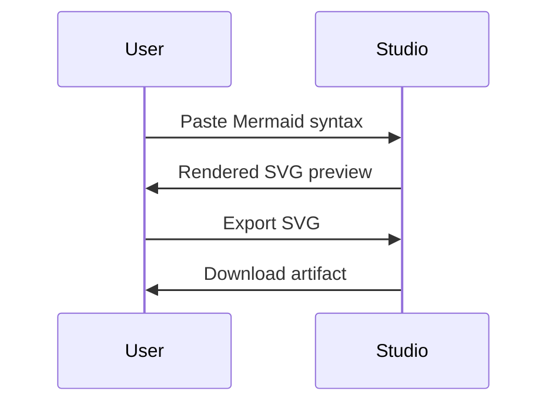

# Ariel View

Ariel View is a lightweight Mermaid.js experience built around two focused deliverables:

1. **Mermaid Viewer** – a minimal UI that accepts Mermaid definitions and presents the rendered chart side-by-side.
2. **Renderer Toolkit** – utilities that wrap Mermaid's native HTML/SVG output so it can be embedded into other surfaces (with HTML as the initial target).

The same codebase powers a static site so diagrams can be authored, previewed, and shared without a server.

## Why this stack

| Layer | Choice | Rationale |
| --- | --- | --- |
| Runtime & build | [Vite](https://vitejs.dev/) + TypeScript | Fast dev server, tiny production output, and first-class TypeScript support without heavy bundler config. |
| Diagram engine | [Mermaid](https://mermaid.js.org/) | Provides the parsing + rendering pipeline we need; we focus on UX and integration. |
| UI composition | Native Web Components (with lit-html if ergonomics demand) | Keeps footprint small while still giving us scoped, reusable pieces. |
| Styling | Hand-authored CSS with a design token palette | Maximizes control over aesthetics without pulling in a large framework. |

No canvas layer is planned for now—Mermaid already emits HTML/SVG, so we lean on the native output to stay efficient and sharp.

## Getting started

```bash
npm install
npm run dev
```

Vite hosts the static site on `http://localhost:5173` (default). To produce a deployable build:

```bash
npm run build
```

The `dist/` folder contains self-contained static assets ready for CDNs or static hosting services.

## Usage

1. Paste or write Mermaid syntax in the editor on the left.
2. The layout locks the editor at 25% width and the preview at 75%; use the mouse wheel/touchpad to zoom and click-drag to pan, or on mobile use the Edit/View toggle and pinch-to-zoom gestures.
3. The toolbar lets you copy SVG markup, download the asset, toggle themes, or auto-fix common bracket/quote mistakes when they occur.

Sample snippet:



## Renderer toolkit

The viewer consumes a small wrapper located at `src/renderer/mermaid-renderer.ts`:

- `configureMermaid(config)` – merges project defaults with optional overrides (e.g., theming).
- `renderMermaidSvg(definition)` – returns `{ svg, bindFunctions, definition, renderId }` for reuse.
- `createSvgDataUri` / `toSvgBlob` – helpers for embedding or exporting Mermaid output.

These utilities keep the rendering concerns reusable should we embed diagrams elsewhere (docs, build-time transforms, etc.).

## Static site shell

`ariel-site-shell` wraps the viewer with a lightweight landing page, feature highlights, and footer copy. Everything ships as static HTML + JS via Vite so hosting only requires serving files.

## Development roadmap

- [x] Bootstrap Vite + TypeScript workspace with Web Component entry point.
- [x] Add Mermaid integration and basic viewer layout.
- [x] Wrap Mermaid render in reusable renderer module (HTML/SVG output).
- [x] Build static site shell (routing, landing page copy, branding).
- [x] Implement export options (copy HTML, save SVG).
- [x] Polish UI (responsive layout, theming, keyboard shortcuts).
- [ ] Add documentation + examples gallery.

## Deployment notes

- `vite build` produces static assets suitable for GitHub Pages, Netlify, or Vercel.
- Prefer immutable asset hosting + CDN caching for quick loads.
- Set security headers for embedding (Content-Security-Policy) when deploying.

## Open questions

- Do we want embedded sample diagrams to seed the textarea?
- Should we hook into third-party storage (GitHub Gists, local persistence)?
- Any additional export formats needed beyond SVG markup?

## Next steps

1. Lock in design tokens and typography guidelines.
2. Prototype shareable presets (saved diagrams, templates).
3. Draft deployment workflow (GitHub Actions or alternative).

